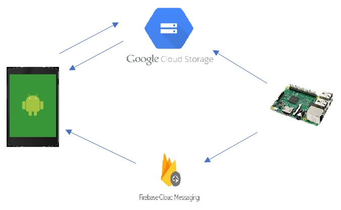

# Raspberry Pi Camera
IoT Raspberry Pi security camera running open-cv for object detection. If the camera detects an object it will send created picture to GoogleCloud and a notification to Android device through FirebaseCloudMessaging. It also runs a server that provides a live video stream over the internet.




## Workflow

After RaspberryPi successfully detects an image, it sends that image to GoogleCloudStorage and sends notification to all Android devices listed through FirebaseCloudMessaging. The notification contains information about picture name. After tapping on the notification the app opens with a view that enables to download the photo from GoogleCloudStorage.


## GoogleCloudStorage

There needs to be a bucket created inside GoogleCloudStorage. Since it requires debit card information, this functionality is turned off at the moment.

After creating a bucket we have to provide its name inside MainActivity.class:
```
public static final String BUCKET_NAME = "<bucket_name>";
```

This will allow to download pictures from that bucket after receiving a notification from FirebaseCloudMessaging.
Apart from that, GoogleCloud project name in which bucket is created needs to be provided in BucketApi class:

```
storage = StorageOptions.newBuilder()
                .setProjectId("<project_name>")
                .setCredentials(ServiceAccountCredentials.fromStream(inputStream))
                .build()
                .getService();
```

##FirebaseCloudMessaging

In order to send notification to Android client it is necessary to save registration id for each client on RaspberryPi device.

These registration ids are obtained from the FirebaseCloudMessaging service when the app starts for the first time. Registration tokens may change when:

 1. The app deletes instance id 
 2. The app is restored on a new device 
 3. The user uninstalls/reinstalls the app 
 4. The user clears app data

Ideally Android client should send its registration id to the server each time it is restored but this functionality is not implemented. Registration ids need to be provide manually for each app. Registration id will be displayed in app's logs when the app is installed for the first time.